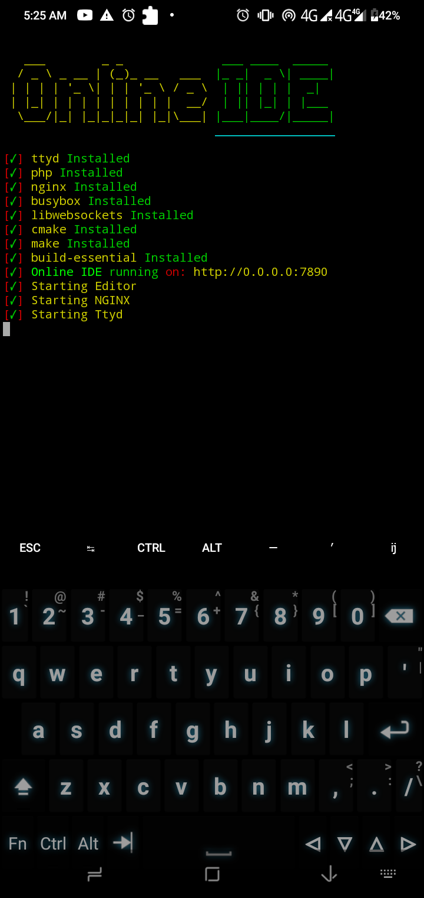
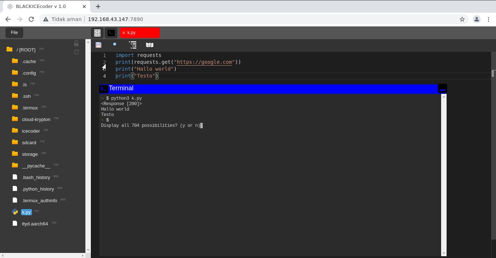

# Installation & Use
<h2><p align="center">Support Termux & Heroku </p></h2>

# Termux
```bash
> git clone https://github.com/krypton-byte/OnlineIDE
> cd OnlineIDE
> apt install python3
> pip3 install colorama requests
> bash termux.sh
```

<p> Custom Options </p>

```
$ bash termux.sh --help
```

# Heroku
[](https://heroku.com/deploy?template=https://github.com/krypton-byte/OnlineIDE/master)
# Screenshot Terminal


# Screenshot Desktop/Web


# Bahan
<ul><li>
<a href="https://github.com/tsl0922/ttyd">TTYD</a></li>
<li><a href="https://github.com/raynoppe/BLACKICEcoder">BLACKICEcoder</a></li>